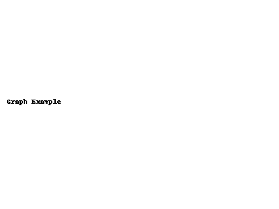

# 放物線の視覚化と数式の学習

---

## 📈 1. 放物線のスケッチ

---

## 🖼 2. 放物線のグラフ画像

---

## 🧮 3. 数学的な説明（MathJax）

放物線の基本形は以下のように表されます：

$$
y = ax^2 + bx + c
$$

特に、$a = 1, b = 0, c = 0$ のとき、  
$$
y = x^2
$$  
となり、頂点は原点 $(0, 0)$ にあります。

---

<!-- MathJax CDN -->

